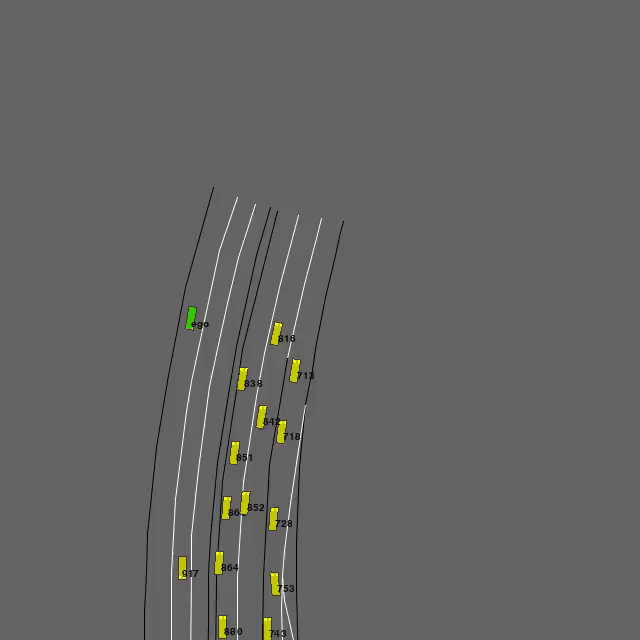
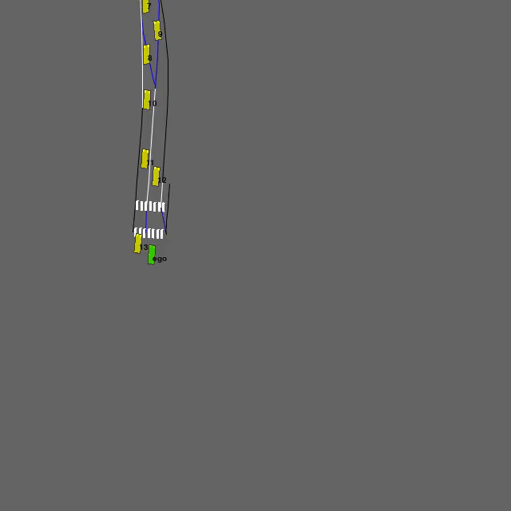
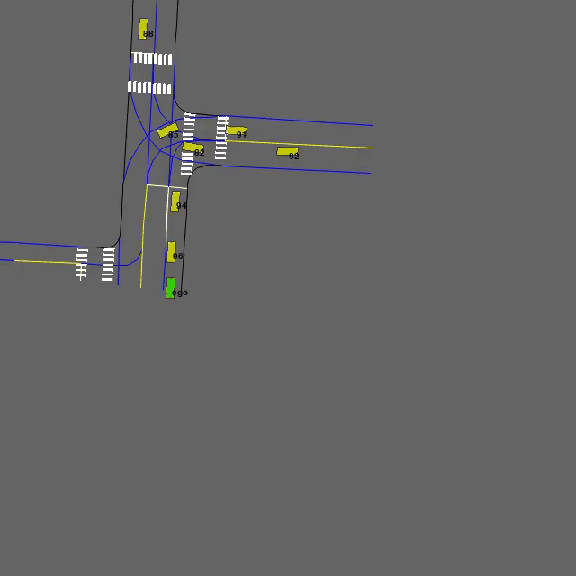
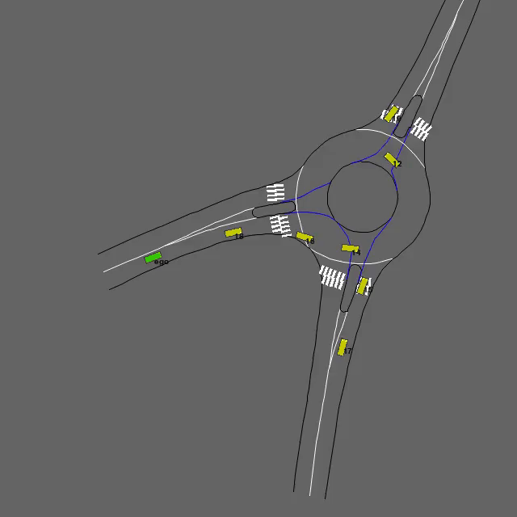
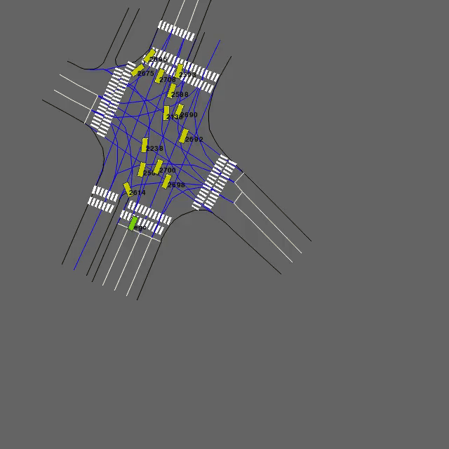
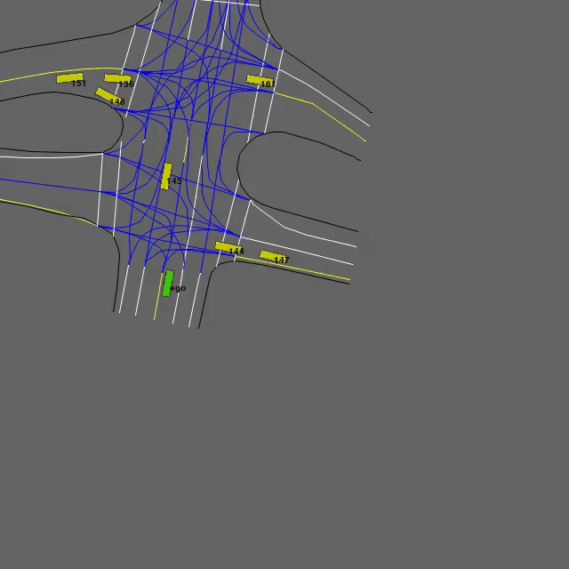

# Interaction_Env_RL
本项目目的是采用模仿学习、强化学习等方法对Interaction数据集中蕴含的驾驶策略进行建模。\
The purpose of this project is to use imitation learning, reinforcement learning and other methods to model the driving strategies contained in [the Interaction datasets](https://interaction-dataset.com/) .

## TODO List
- [x] 数据预处理 
- [x] 仿真环境搭建 
- [x] 扩散策略
- [ ] GAIL
- [ ] GNN-GAIL

## 环境(Environment)
- 汇入场景
<table>
    <tr>
        <td></td>
        <td></td>
    </tr>
</table>

- 环岛场景

<table>
    <tr>
        <td></td>
        <td></td>
        <td></td>
    </tr>
    <tr>
        <td></td>
        <td></td>
    </tr>
</table>

- 路口场景

<table>
    <tr>
        <td></td>
        <td></td>
        <td></td>
    </tr>
    <tr>
        <td></td>
        <td></td>
    </tr>
</table>

## 1. 环境安装(Setup)

```shell
conda create -n interaction python=3.8
conda activate interaction
pip install -r requirements.txt
```

## 2.实验(Experiments)
- 数据预处理(Data Preprocessing)
```shell
cd examples
python dp.py --dataset-path your/dataset/path
```

- 数据回放(Data Replay)
```shell
cd examples
python env_test.py --dataset-path your/dataset/path　--save-video
```

## **参考资料(Reference)：**
> - [HighwayEnv](https://github.com/Farama-Foundation/HighwayEnv)
> - [NGSIM_env](https://github.com/MCZhi/Driving-IRL-NGSIM)
> - [LimSim](https://github.com/PJLab-ADG/LimSim)
> - [Interaction-dataset](https://github.com/interaction-dataset/interaction-dataset)
> - [Diffusion Policy](https://github.com/real-stanford/diffusion_policy)
> - [GAIL](https://github.com/ikostrikov/pytorch-a2c-ppo-acktr-gail)

